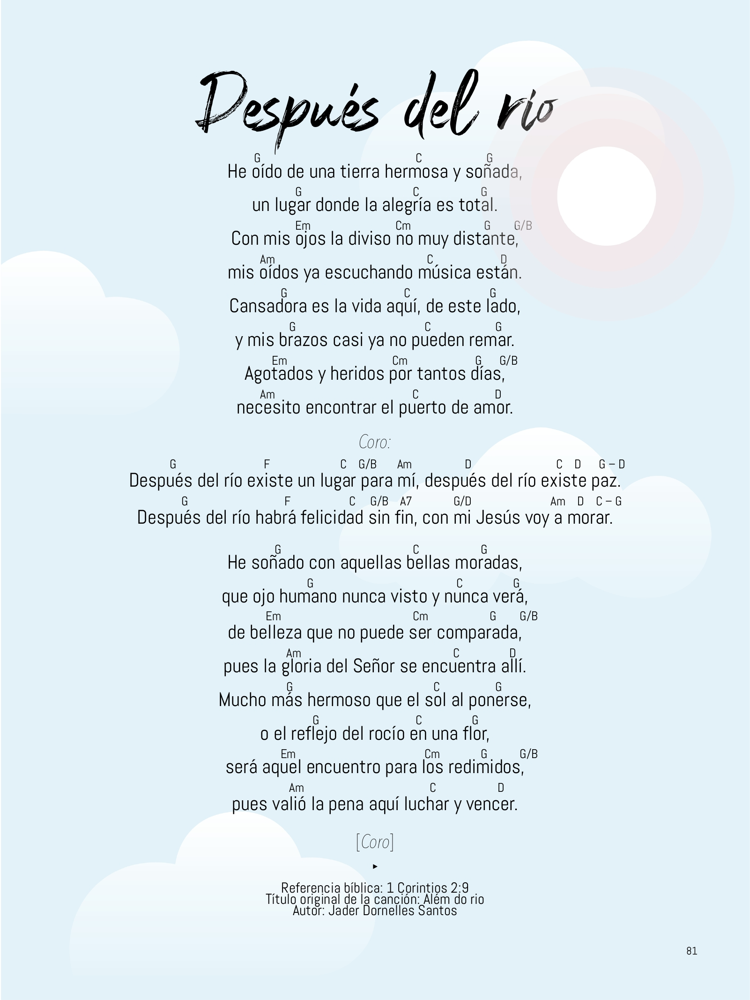
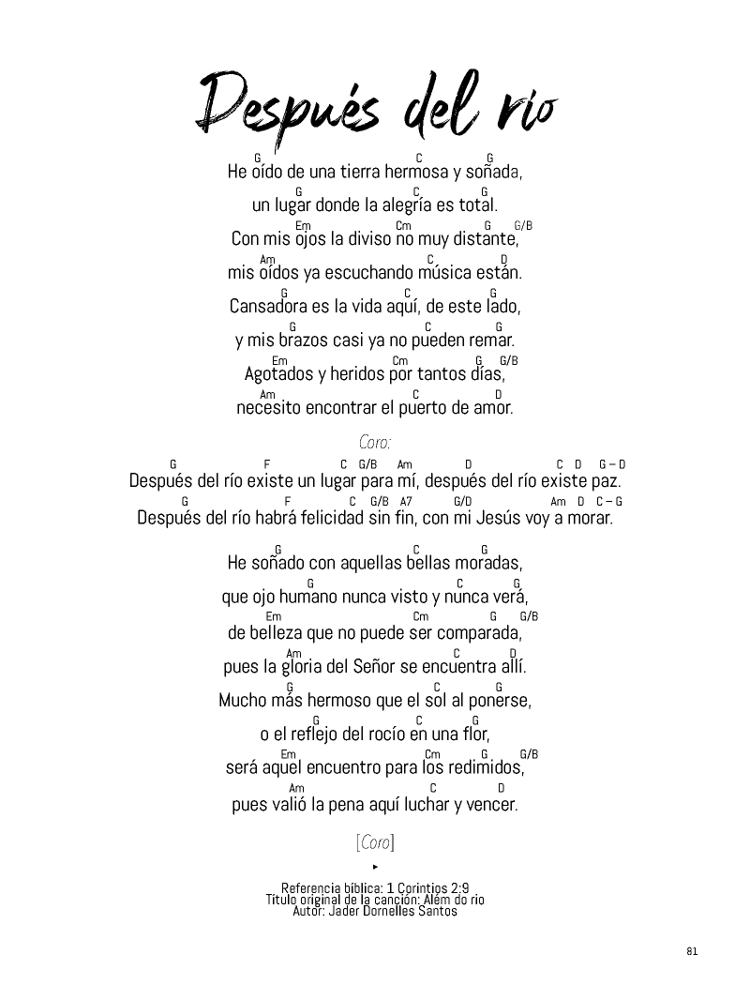

# ULTIMATE IMAGE COMPRESSOR
_1. Converts image to only binary-coloured (black & white)
2. Halves the size of the image (by default, but u can change it)_
 
### Let's see it work:
#####     BEFORE

**Size: 760 KB**
 
#####     AFTER

**Size: 41.7 KB**
 
_Amazing, isn't it?_
 
Insp. by: https://github.com/maksimKorzh/open-cv-tutorials/blob/main/src/colors/colors.py
